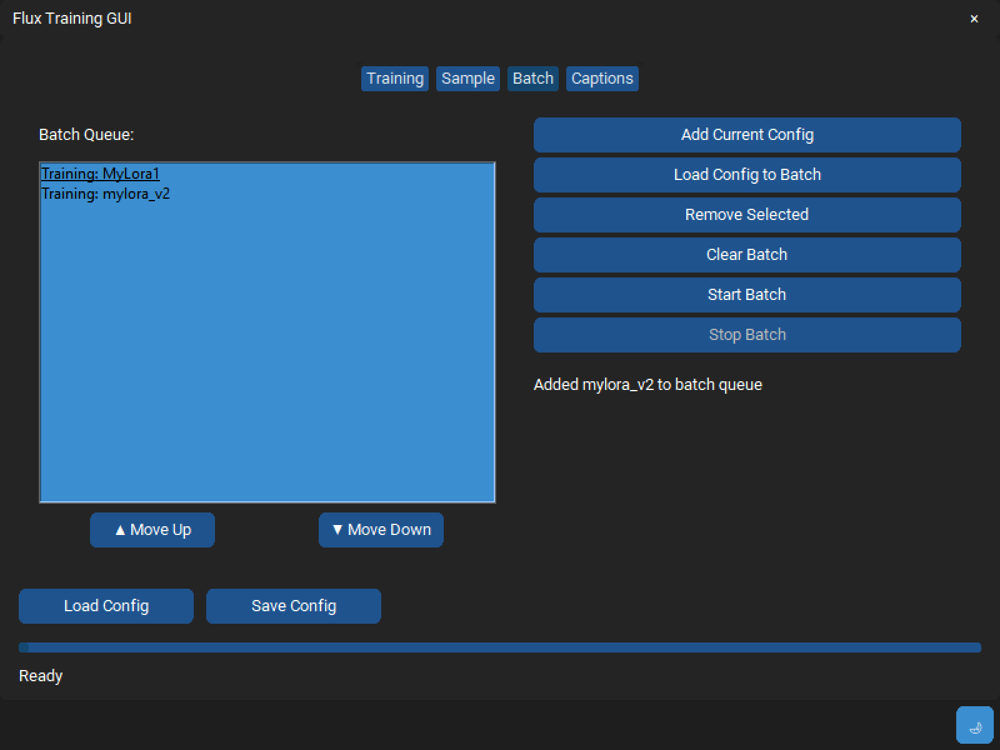

# AI-TK-UI

A modern GUI for AI-Toolkit, making it easier to train and manage your LoRA models.

## Acknowledgments

- Based on [AI-Toolkit](https://github.com/ostris/ai-toolkit) - The core toolkit this UI is built for
- Uses [CustomTkinter](https://github.com/TomSchimansky/CustomTkinter) - Modern UI widgets for tkinter
- [PyTorch](https://github.com/pytorch/pytorch) - The deep learning framework used
- Community contributions and feedback

## New Features in V2 Branch

### Batch Processing
- **Batch Queue System**: Add multiple training configurations to a queue
- **Ordered Processing**: Process training jobs in sequence with configurable order
- **Pre-task Processing**: Automatically handles pre-tasks (like UTF-8 conversion) before training
- **Batch Controls**: 
  - Add current config to batch
  - Load saved configs to batch
  - Reorder batch items (Move Up/Down)
  - Remove items from batch
  - Clear entire batch
  - Start/Stop batch processing

### Enhanced UTF-8 Handling
- **Automatic Conversion**: Convert caption files to UTF-8 before training
- **Configurable**: Enable/disable UTF-8 conversion per configuration
- **Progress Tracking**: Clear status updates during conversion process

### Improved UI/UX
- **Dark/Light Theme**: Toggle between dark and light themes
- **Status Updates**: Clear status messages for all operations
- **Better Error Handling**: Improved error messages and logging
- **Responsive Design**: UI remains responsive during long operations
- **Tab Organization**: 
  - Training tab for single model training
  - Batch tab for managing multiple training jobs
  - Sample tab for managing prompts
  - Captions tab for caption management

### Configuration Management
- **Save/Load Configs**: Save and load training configurations
- **Auto-save**: Automatically saves current settings
- **Template System**: Use configuration templates for quick setup
- **Batch Import**: Load multiple configurations into the batch queue

### Training Features
- **Learning Rate Presets**: Pre-configured learning rates with descriptions
- **Auto Steps Calculation**: Automatically calculate training steps based on dataset size
- **Resolution Options**: Support for multiple training resolutions
- **Network Settings**: Configure LoRA network parameters
- **Model Settings**: Configure model paths and options
- **Dataset Management**: Manage training data and caption files

## Screenshots

### Main Training Interface

- Complete training configuration interface
- Model and dataset settings
- Network parameters and learning rate options

### Batch Processing

- Queue multiple training jobs
- Manage training order
- Monitor batch progress

### Sample Management

- Configure test prompts
- Set sampling parameters
- Preview settings

### Caption Management

- Manage training captions
- UTF-8 conversion tools
- Template system

### Dark/Light Theme Support

- Switch between dark and light modes
- Modern, responsive design
- Customizable interface

## Installation

1. Clone the repository:
```bash
git clone https://github.com/yourusername/ai-tk-ui.git
```

2. Run the start.bat file to:
   - Set up the Python virtual environment
   - Install required dependencies
   - Configure paths
   - Launch the GUI

## Usage

1. **Single Model Training**:
   - Configure your training settings in the Training tab
   - Click "Start Training" to begin

2. **Batch Processing**:
   - Add configurations to the batch queue
   - Arrange them in desired order
   - Click "Start Batch" to process all jobs

3. **Caption Management**:
   - Use the Captions tab to manage your training data
   - Convert captions to UTF-8 as needed

4. **Sample Management**:
   - Configure sampling settings in the Sample tab
   - Add test prompts for validation during training

## Requirements

- Python 3.10 or higher
- CUDA compatible GPU
- Windows 10/11 (WSL2 supported)

## Dependencies

- PyTorch
- CustomTkinter
- PyYAML
- Chardet

## Contributing

Contributions are welcome! Please feel free to submit a Pull Request.

## License

This project is licensed under the MIT License - see the LICENSE file for details.

## Support

For issues and feature requests, please use the GitHub issue tracker.

## Prerequisites

- Python 3.10 or higher
- Git
- CUDA compatible GPU (for AI-Toolkit)

## Configuration

The application uses several configuration files:
- `config.yaml`: Main configuration file for paths and settings
- `last_settings.json`: Saves your last used settings

## Directory Structure
```
ai-tk-ui/
├── README.md           # Project documentation
├── gui.py             # Main GUI application
├── start.bat          # Setup and launch script
├── requirements.txt   # Python dependencies
├── config.yaml        # Main configuration file
├── screenshots/       # GUI screenshots
│   ├── training_tab.png
│   ├── batch_tab.png
│   ├── sample_tab.png
│   ├── caption_tab.png
│   └── theme_toggle.png
└── ai-toolkit/        # AI-Toolkit installation (managed by start.bat)
    ├── config/
    ├── models/
    └── scripts/
```

## Usage

1. Launch the application using `start.bat`
2. Configure your AI-Toolkit settings
3. Use the GUI to manage and train models

## Contributing

1. Fork the repository
2. Create your feature branch (`git checkout -b feature/amazing-feature`)
3. Commit your changes (`git commit -m 'Add amazing feature'`)
4. Push to the branch (`git push origin feature/amazing-feature`)
5. Open a Pull Request

## License

This project is licensed under the MIT License - see the LICENSE file for details.

## Acknowledgments

- [AI-Toolkit](https://github.com/ostris/ai-toolkit) - The core toolkit this UI is built for

### Project Structure

- `gui.py`: Main application entry point
- `start.bat`: Environment setup and launcher
- `requirements.txt`: Project dependencies

### Coding Standards

- Follow PEP 8 guidelines
- Include docstrings for functions and classes
- Add comments for complex logic
- Update documentation for new features

## Support

For support, please:
1. Check existing issues on GitHub
2. Create a new issue with:
   - Detailed description of the problem
   - Steps to reproduce
   - System information
   - Error messages

## Roadmap

- [ ] Additional model management features
- [ ] Enhanced training visualization
- [ ] Multi-language support
- [ ] Dark/Light theme support
